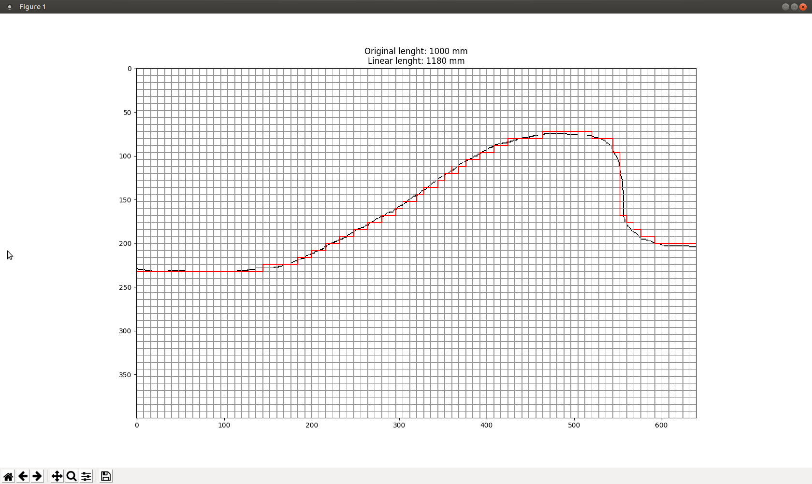
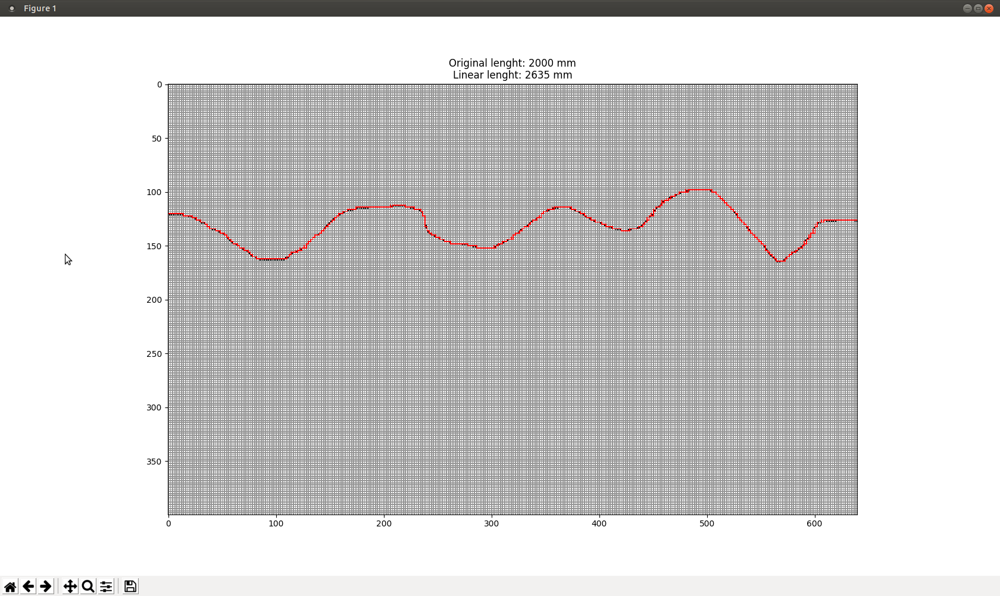
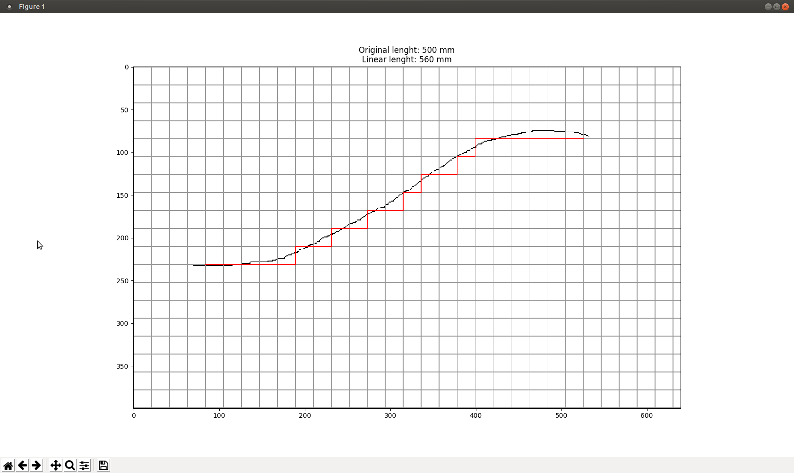

# Line sampling.
## Usage
```
sampling.py [-h] [--thickness THICKNESS] image linelength dimension
```
Note: the thickness is not working well yet.
# Demo
```
python sampling.py 1.png 1000 10
```

```
python sampling.py 2.png 2000 5
```

```
python sampling.py 3.png 500 20
```
